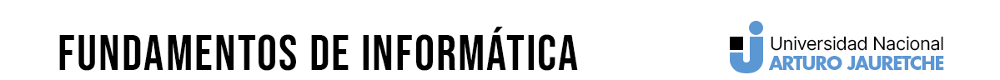

<p align="center">
<a href="https://www.linkedin.com/in/soriamaximilianorodrigo/" target="_blank" rel="noopener noreferrer">
</a></p>


# Práctica 3 - Funciones


[📂 PDF PRACTICAS 3](docs/Practica%203%20de%20Funciones.pdf)

[⬅️ Volver](../README.MD)

### PARTE I: Aspectos Conceptuales

a) ¿Qué ventajas tiene la utilización de funciones?

> ### Respuesta
> 
>- Las funciones permiten modularizar el código, facilitando la reutilización y el mantenimiento.
>- Mejoran la legibilidad del código al dividirlo en bloques más pequeños y especializados.

b) ¿Hay algún cuidado en el orden en el que se pasan los parámetros a una función?

> ### Respuesta
> 
> - Sí, el orden de los parámetros debe coincidir con el orden definido en la función.

c) ¿Cuándo uso la sentencia return?

> ### Respuesta
> 
> - Se utiliza `return` para devolver un valor desde una función. Es opcional, pero necesario si se desea que la función retorne algún resultado.

d) ¿Qué diferencia hay entre la definición y la invocación de una función?

> ### Respuesta
> 
>- La definición es donde se crea la función, especificando su nombre, parámetros y cuerpo.
>- La invocación es cuando se llama a la función para ejecutar su código.

e) ¿Qué son los parámetros formales y para qué sirven? Ejemplifique.
-
> ### Respuesta
> 
>- Los parámetros formales son variables utilizadas en la definición de la función. Sirven como marcadores de posición para los valores reales que se pasarán durante la invocación.
> Ejemplo: `def suma(a, b):`

f) ¿Qué son los parámetros reales y para qué sirven? Ejemplifique.
> ### Respuesta
> 
> Los parámetros reales son los valores reales que se pasan a la función durante su invocación. Sirven para proporcionar datos concretos que la función utilizará.
>  Ejemplo: `suma(5, 3)`

g) ¿Qué es el cuerpo de una función? Ejemplifique.
> ### Respuesta
> 
> - El cuerpo de una función es el bloque de código que se ejecuta cuando la función es llamada. Contiene las instrucciones y operaciones específicas de la función.
  Ejemplo:
  ```python
  def imprimir_mensaje():
      print("Hola, este es un mensaje.")
  ```

h) ¿Existen funciones sin parámetros o argumentos?
> ### Respuesta
> 
>- Sí, existen funciones que no requieren parámetros. Pueden realizar tareas sin depender de valores externos.
>

i) ¿Puede usar una letra o un número como parámetro formal? ¿Y cómo parámetros reales?
> ### Respuesta
> 
>- Sí, se puede usar una letra o un número como parámetro formal. Los parámetros reales pueden ser valores, variables o expresiones.

j) ¿Puedo tener una cantidad distinta de parámetros formales que reales en una función?
> ### Respuesta
> 
> - En Python, sí. Se pueden definir funciones con un número variable de parámetros utilizando `*args` o `**kwargs`.

### PARTE II: Ahora practicamos

Ejercicio 1: Mencione los errores en los siguientes códigos:
a) 
```python
def suma(par1, par2):
    print(par1+par2)
suma()
```

> ### Respuesta
>- Falta pasar los argumentos a la función durante la invocación.

b)
```python
def suma(par1, par2):
    print(par1 + par2)
print(suma(12, 10))
```
> ### Respuesta
>- La función `suma` imprime la suma, pero luego se intenta imprimir el resultado de la función, lo cual es `None`.

c)
```python
def suma(par1, par2):
    return (par1 + par2)
suma(12, 10)
```
> ### Respuesta
>- La función retorna la suma, pero el resultado no se imprime ni se almacena.

d)
```python
def suma(par1):
    return (par1 + 2)
suma(12, 10)
```
> ### Respuesta
>- Se pasa un número incorrecto de argumentos a la función `suma`.

### Ejercicio 2: 
Definir una función denominada imprimir_mensaje que imprima el siguiente mensaje en pantalla: “Estudiando Fundamentos de Informática en la UNAJ”

>### Respuesta
> [ejercicio2.py](practicas/02_ejercicio.py)


### Ejercicio 3: 
Definir una función denominada retorno_mensaje que retorne el siguiente mensaje: “Estudiando Fundamentos de Informática en la UNAJ”.

A. Para mostrar ese mensaje en pantalla:

B. La diferencia con el ejercicio anterior es que en este caso, la función devuelve el mensaje en lugar de imprimirlo directamente.

C. Modificación para mensajes diferentes:

>### Respuesta
> [ejercicio3.py](practicas/03_ejercicio.py)
>

> a) Se muestra en ejercicio3.py
> 
> b) La diferencia es que recibe un parametro
>
> c) EN ejercici3.py esta la version un parametro


### Ejercicio 4: Definir una función denominada imprimo_fecha que reciba tres cadenas de caracteres que representan un día, un mes y un año e imprima la fecha de la siguiente manera: “ 21 de septiembre de 2012”.

>### Respuesta
> [ejercicio4.py](practicas/04_ejercicio.py)

### Ejercicio 5: 
Definir una función denominada cuantos_dias que reciba el número de mes como
parámetro y retorne la cantidad de días que posee. Ejemplo: cuantos_dias(1), debería retornar 31.
Ayuda: Pensar en tener una lista de la siguiente manera: [[“enero”,31], [“febrero”, 28], ...]

>### Respuesta
> [ejercicio5.py](practicas/05_ejercicio.py)


### Ejercicio 6: 
Definir una función que reciba un número como parámetro y mostrar la tabla de
multiplicar de dicho número

>### Respuesta
> [ejercicio6.py](practicas/06_ejercicio.py)

### Ejercicio 7: 
Definir una función que calcule el área de un círculo, otra que calcule el área de un
rectángulo y otra que calcule el área de un rectángulo. Analice qué parámetros deberían recibir dichas
funciones.

>### Respuesta
> [ejercicio7.py](practicas/07_ejercicio.py)

## Ejercicios Complementarios

### Ejercicio 8: 

Definir una función llamada calculo_rebaja que reciba dos números, uno con el precio
anterior y otro para el precio rebajado y devuelva un número que represente el porcentaje rebajado.

>### Respuesta
> [ejercicio8.py](practicas/08_ejercicio.py)


### Ejercicio 9: 
Definir una función llamada calculo_nuevo_precio que reciba dos números, uno con el
precio anterior y otro con el número de porcentaje a aumentar y devuelva el precio aumentado.

>### Respuesta
> [ejercicio9.py](practicas/09_ejercicio.py)

### Ejercicio 10: 
Definir una función llamada calculo_transporte que reciba cuatro números: la cantidad
de alumnos de 1era, 2da y 3er. salita de un jardín de infantes y la cantidad de asientos del transporte
escolar. La función debe retornar cuántos micros necesito contratar para una excursión sabiendo que
cada salita es acompañada por tres adultos.

>### Respuesta
> [ejercicio10.py](practicas/10_ejercicio.py)

### Ejercicio 11: 
Definir una función llamada armo_cartel que reciba una cadena de caracteres (para el
nombre del producto) y dos números (el precio anterior y el otro para el precio rebajado) e imprima un
cartel de la siguiente forma:

> *************************************
>Atención!!! Gran rebaja para el producto nombre (recibido como parámetro)
>Antes: precio anterior (dato recibido como parámetro)
>Ahora: precio rebajado (dato recibido como parámetro)


>### Respuesta
> [ejercicio11.py](practicas/11_ejercicio.py)

### Ejercicio 12: 
Definir una función llamada calculo_litros que reciba tres números, el alto, ancho y
profundidad (en metros) de una pileta y devuelva la cantidad de litros que tiene.

>### Respuesta
> [ejercicio12.py](practicas/12_ejercicio.py)


### Ejercicio 13: 

Definir una función llamada a_pagar que reciba 4 números: la cantidad de personas, el
monto gastado en bebida, el monto gastado en comida y el del alquiler del lugar, y retorne cuánto le
toca pagar a cada uno.

>### Respuesta
> [ejercicio13.py](practicas/13_ejercicio.py)

### Ejercicio 14: 
Definir tres funciones llamadas convertir_a_dolar, convertir_a_euro y
convertir_a_real. Cada función recibe un parámetro que representa un monto en pesos y devuelve su
conversión respectiva.

>### Respuesta
> [ejercicio14.py](practicas/14_ejercicio.py)

### Ejercicio 15: 
Definir una función llamada calculo_dosis que reciba tres números. Uno para la cantidad
de días que debe suministrarse el remedio, el segundo dato para la cantidad de veces por día que debe
tomarlo, y el último dato para la cantidad de comprimidos que trae el envase. La función debe devolver
verdadero si el envase alcanza para ese tratamiento y falso si no alcanza.

>### Respuesta
> [ejercicio15.py](practicas/15_ejercicio.py)

### Ejercicio 16: 
Definir una función llamada precio_con_iva que agrega el IVA (21%) de un producto
dado su precio de venta sin IVA.

>### Respuesta
> [ejercicio16.py](practicas/16_ejercicio.py)


## Ejercicios a entregar

Los ejercicios realizados anteriormente se solicita la entrega de los siguientes:

### Ejercicio 4: 
Definir una función denominada imprimo_fecha que reciba tres cadenas de caracteres que
representan un día, un mes y un año e imprima la fecha de la siguiente manera: “ 21 de septiembre de
2012”.

>### Respuesta
> [ejercicio4.py](practicas/04_ejercicio.py)


### Ejercicio 5: 
Definir una función denominada cuantos_dias que reciba el número de mes como
parámetro y retorne la cantidad de días que posee. Ejemplo: cuantos_dias(1), debería retornar 31.
Ayuda: Pensar en tener una lista de la siguiente manera: [[“enero”,31], [“febrero”, 28], ...]

>### Respuesta
> [ejercicio5.py](practicas/05_ejercicio.py)

### Ejercicio 15: 
Definir una función llamada calculo_dosis que reciba tres números. Uno para la cantidad
de días que debe suministrarse el remedio, el segundo dato para la cantidad de veces por día que debe
tomarlo, y el último dato para la cantidad de comprimidos que trae el envase. La función debe devolver
verdadero si el envase alcanza para ese tratamiento y falso si no alcanza. 

>### Respuesta
> [ejercicio15.py](practicas/15_ejercicio.py)