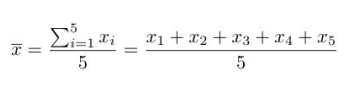

<p align="center">
<a href="https://www.linkedin.com/in/soriamaximilianorodrigo/" target="_blank" rel="noopener noreferrer">
</a></p>


# Práctica 5  - Estructuras de control 


[📂 PDF PRACTICAS 5](docs/Practica%205.pdf)

[⬅️ Volver](../README.MD)


## Parte | : Aspectos Conceptuales

a) ¿Que estructuras de control conoce? ¿En qué se diferencian?

b) ¿Qué tipo de sentencias puedo escribir dentro del cuerpo de una estructura de
control?

c) ¿Se puede escribir una estructura de control dentro de otra?


> Respuestas
>
> **a) Estructuras de control en Python:**
> 
> En Python, las estructuras de control son fundamentales para controlar el flujo de ejecución del programa. Las principales estructuras de control son:
>
> 1. **if-else:**
>   ```python
>   if condicion:
>       # bloque de código si la condición es verdadera
>   else:
>       # bloque de código si la condición es falsa
>   ```
>
> 2. **while:**
>   ```python
>   while condicion:
>       # bloque de código ejecutado mientras la condición sea verdadera
>   ```
>
> 3. **for:**
>   ```python
>   for variable in secuencia:
>       # bloque de código que se repite para cada elemento de la secuencia
>   ```
>
> **Diferencias:**
>
> - **if-else:** Permite ejecutar un bloque de código si la condición es verdadera y otro bloque si es falsa.
>
> - **while:** Ejecuta un bloque de código mientras la condición sea verdadera.
>
> - **for:** Itera sobre una secuencia (como listas, tuplas, etc.) y ejecuta un bloque de código para cada elemento.
>
> **b) Sentencias dentro del cuerpo de una estructura de control:**
>
> Dentro del cuerpo de una estructura de control, como un if, while o for, puedes escribir diversas sentencias, entre ellas:
>
> - Declaración de variables.
> - Operaciones aritméticas y lógicas.
> - Llamadas a funciones.
> - Otras estructuras de control (anidación).
>
> **c) Anidación de estructuras de control:**
>
> Sí, es posible anidar estructuras de control en Python. Esto implica colocar una estructura de control dentro del cuerpo de otra. Por ejemplo:
>
> ```python
> if condicion_externa:
>    # bloque de código exterior
>    if condicion_interna:
>        # bloque de código interior
> ```
>
> La anidación permite una mayor complejidad en la lógica del programa, pero se debe utilizar con precaución para mantener la legibilidad del código.


## Parte II: Ahora practicamos

### Ejercicio 1: 
Escribir un programa que muestre la tabla de multiplicar de un número
introducido por teclado por el usuario.

>### Respuesta
> [ejercicio01.py](practicas/01_practica.py)

### Ejercicio 2: 
Escribir un programa que calcule la sumatoria desde 0 hasta m, donde m es un número introducido por el usuario desde el teclado.

>### Respuesta
> [ejercicio02.py](practicas/02_practica.py)


### Ejercicio 3: 
Escribir un programa que muestre la tabla de los códigos ASCII. Los códigos ASCII van de 0 a 255

>### Respuesta
> [ejercicio03.py](practicas/03_practica.py)


### Ejercicio 4: 
Escribir un programa que lea letras del teclado indefinidamente hasta que el usuario ingrese `fin` e imprima el código ASCII de las mismas.

>### Respuesta
> [ejercicio04.py](practicas/04_practica.py)


###  Ejercicio 5: 
Escribir un programa que calcule el promedio de N números ingresados por el usuario. (AYUDA: al comenzar el programa debe preguntar la cantidad de números a ingresar, luego iterar y leer tantos números del teclado como se indicó al inicio.)

>### Respuesta
> [ejercicio05.py](practicas/05_practica.py)


###  Ejercicio 6: 
Escriba un programa que lea nombres de personas hasta que se ingrese el  nombre `zzz`. Debe imprimir la cantidad de nombres que comienzan con `A`.

>### Respuesta
> [ejercicio06.py](practicas/06_practica.py)

###  Ejercicio 7: 
Escriba un programa que lea números de documentos de identidad de personas hasta que se ingrese el número `999`. Debe imprimir la cantidad de números de documentos menores que 20.000.000.

>### Respuesta
> [ejercicio07.py](practicas/07_practica.py)

###  Ejercicio 8: 
Escriba un programa que reciba del usuario su nombre, apellido y patente hasta que ingrese AAA, e imprima si está exento de impuesto o no. Tener en cuenta que los autos cuyas patentes empiezan con R, S y T no deben pagar impuesto.

>### Respuesta
> [ejercicio08.py](practicas/08_practica.py)

###  Ejercicio 9: 
Escriba un programa que solicite códigos postales de localidades e imprima si esa localidad es La Plata, Florencio Varela u otra. Recordar que el código postal de La
Plata es 1900 y el de Florencia Varela es: 1887. El programa termina cuando se ingresa el código postal 0.

>### Respuesta
> [ejercicio09.py](practicas/09_practica.py)


###  Ejercicio 10: 
Definir una función que imprima los primeros cien números enteros. ¿Se le ocurre otra forma de hacerlo?

>### Respuesta
> [ejercicio10.py](practicas/10_practica.py)


###  Ejercicio 11: 
Implementar un función que muestre todos los múltiplos de n entre n y m - n, ambos inclusive, donde n y m son parámetros de la función.

>### Respuesta
> [ejercicio11.py](practicas/11_practica.py)


## Parte III: Ahora practicamos con Colecciones

###  Ejercicio 12: 
Dada la siguiente lista [1, 14, 56, 43, 23, 46, 58, 123, 67 ] escribir un programa que muestre el número más alto.

>### Respuesta
> [ejercicio12.py](practicas/12_practica.py)


###  Ejercicio 13: 
Escriba un programa que solicite nombres de localidades y códigos postales al usuario hasta que se ingresa el código postal 0. Debe generar una lista con todos los valores ingresados e imprimirla.

>### Respuesta
> [ejercicio13.py](practicas/13_practica.py)


###  Ejercicio 14: 
Realice un programa para manejar equipos de fútbol.

a) Definir una función que arme una lista con la información de los equipos. De cada equipo se quiere guardar el nombre del equipo, puntaje en la tabla de posiciones y la cantidad de goles a favor. El ingreso finaliza cuando se lee el nombre del equipo igual azzz.

b) Usando la lista anterior, imprimir la cantidad de goles a favor que tienen los equipos
que están en la primera y última posición de la lista.

c) Imprimir el nombre del equipo Campeón de la lista del ejercicio anterior.


>### Respuesta
> [ejercicio14.py](practicas/14_practica.py)


## Parte IV: Ahora practicamos con menúes

### Ejercicio 15: 
Escriba un programa que le solicite al usuario que elija una opción del siguiente menú y, de acuerdo a la opción elegida, le solicite los datos restantes para
imprimir el área de la figura elegida:

Menú de opciones

1.- Círculo

2.- Cuadrado

3.- Rectángulo

>### Respuesta
> [ejercicio15.py](practicas/15_practica.py)

###   Ejercicio 16: 
Escriba un programa que le solicite al usuario que ingrese un monto de dinero y una opción del siguiente menú. De acuerdo a la opción elegida, imprima cuanto
equivale el monto en dólares, en euros y en reales. Utilizar las funciones ya definidas en el ejercicio 14 de la práctica 3 (convertir_a_dolar, convertir_a_euro y convertir_a_real).

>### Respuesta
> [ejercicio16.py](practicas/16_practica.py)

###  Ejercicio 17:

a) Definir una función que permita el ingreso de números por teclado hasta ingresar el O, y retorne esa lista.

b) Definir una función que reciba como parámetro una lista de números y retorne como resultado el promedio.

c) Definir una función que reciba como parámetro una lista de números y retorne como resultado la suma de los números.

d) Definir una función que reciba como parámetro una lista de números y retome el número más grande de la lista (máximo).

e) Definir una función que reciba como parámetro una lista de números y retorne el número más pequeño de la lista (mínimo).

Utilizar las funciones definidas anteriormente para construir un programa que permita elegir una opción del siguiente menú:

1. Ver el promedio de los números
2. Ver la suma de los números
3. Ver la cantidad de números
4. Ver el número máximo
5. Ver el número mínimo

Recordar que el promedio de números se calcula como la suma sobre la cantidad. Por
ejemplo, en el caso de 5 números sería:

<p align="center">
<a href="#" target="_blank" rel="noopener noreferrer">
</a></p>

>### Respuesta
> [ejercicio17.py](practicas/17_practica.py)

## Ejercicios a entregar


De los ejercicios realizados anteriormente se solicita la entrega de los siguientes:

### Ejercicio 1: 
Escribir un programa que muestre la tabla de multiplicar de un número introducido por teclado por el usuario.

### Ejercicio 7: 
Escriba un programa que lea números de documentos de identidad de personas hasta que se ingrese el número `999`. Debe imprimir la cantidad de números de documentos menores que 20.000.000.

### Ejercicio 12: 
Dada la siguiente lista [1, 14, 56, 43, 23, 46, 58, 123, 67 ] escribir un programa que muestre el número más alto.

### Ejercicio 13: 
Escriba un programa que solicite nombres de localidades y códigos postales al usuario hasta que se ingresa el código postal 0. Debe generar una lista con todos los valores ingresados e imprimirla.

