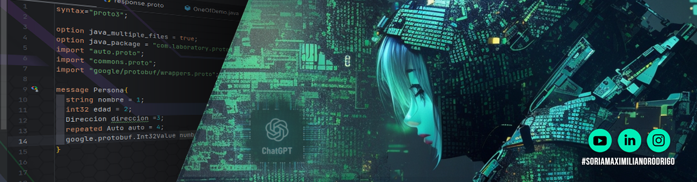

  
  
  

### ⭐ Lista de Prácticas

Aquí podés encontrar los enunciados y resoluciones de las distintas practicas

| Enlace                                          | Descripción              |
|-------------------------------------------------|--------------------------|
| [🔗 Practicas 1](/01_practicas/README.MD)                | Conceptos basicos        |
| [🔗 Practicas 2](/02_practicas/README.MD)                  | Tipo de datos            |
| [🔗 Practicas 3](/03_practicas/README.MD)               | Funciones                |
| [🔗 Practicas 4](/04_practicas/README.MD)              | Sentencias condicionales |
| [🔗 Practicas 5](/05_practicas/README.MD)| Listas                   |
| [🔗 Practicas 6](/06_practicas/README.MD) | Corte de control         |

### ⭐ Lista de Power points

Aquí podés encontrar los Power Point vistos en clase

| Enlace                              | Descripción                            |
|-------------------------------------|----------------------------------------|
| [🔗 PPT 1](docs/ppts/01-conceptos_basicos.pdf)           | Conceptos basicos                      |
| [🔗 PPT 2](docs/ppts/02-variables_y_tipos_de_datos.pdf) | Variables y tipos de datos             |
| [🔗 PPT 3](docs/ppts/03-tipos_de_datos.pdf) | Tipo de datos                          |
| [🔗 PPT 4](docs/ppts/04-listas_y_tuplas.pdf) | Lista y tuplas                         |
| [🔗 PPT 5](docs/ppts/05-funciones.pdf) | Funciones                              |
| [🔗 PPT 6](docs/ppts/06-estructuras_de_control_condicionales.pdf) | Estructuras de control y condicionales |

### ⭐ Parciales

- [🔗 Parciales](/07_parciales/README.MD)

---

### ⭐ Contacto

📧 MaximilianoRodrigoSoria@gmail.com
